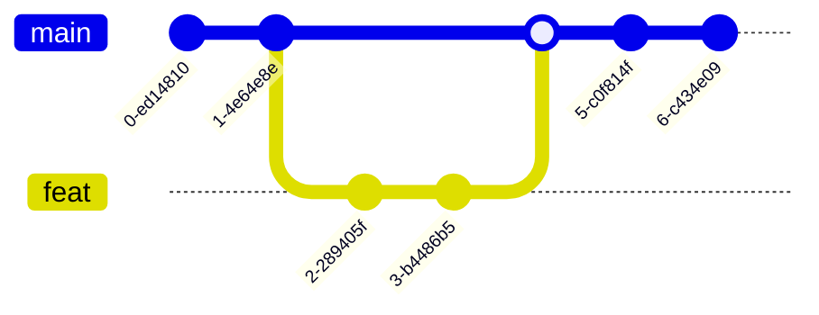
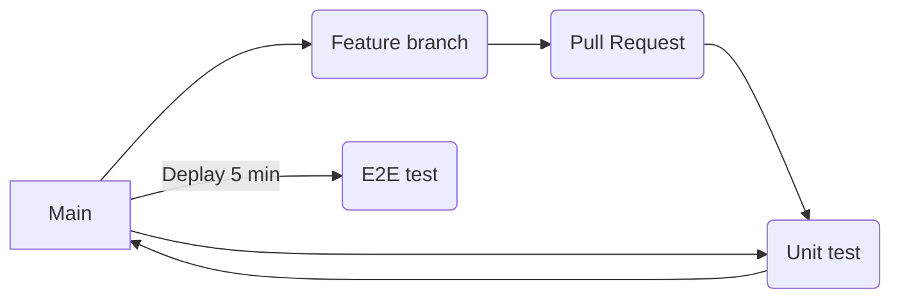

# Github actions

# Git flow

```mermaid
gitGraph
    commit
    commit
    branch feat
    checkout feat
    commit
    commit
    checkout main
    merge feat
    commit
    commit
```

```mermaid
flowchart LR
    main[Main] --> featureBranch(Feature branch)
    featureBranch --> pr
    pr(Pull Request) --> githubUnitTest
    githubUnitTest(Unit test) --> main
    main --> githubUnitTest(Unit test)
    main --> |Deplay 5 min| githubE2ETest(E2E test)

```
